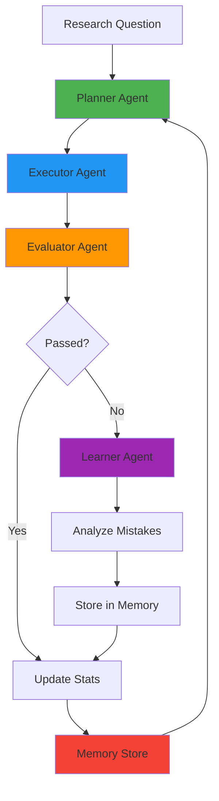

# 🧠 Self-Improving AI Research Agent

A production-quality AI research agent that **learns from its own mistakes** using feedback loops and persistent memory. Built with Groq API, DuckDuckGo search, and LangChain.

[](https://www.python.org/downloads/)
[](https://opensource.org/licenses/MIT)

## 🎯 Overview

This agent demonstrates **self-improving AI behavior** through:

- **Early runs**: Makes mistakes (skips tools, wrong order, premature answers)
- **Evaluation**: Judges each run against quality criteria
- **Learning**: Analyzes failures and stores patterns in persistent memory
- **Improvement**: Injects learned constraints into future planning

**Key Innovation**: The agent doesn't need perfect code—it learns perfect behavior through experience.

## 🏗️ Architecture



### Components

| Component | Purpose | Technology |
|-----------|---------|------------|
| **Planner** | Creates step-by-step research plans | Groq LLM (mixtral-8x7b) |
| **Executor** | Runs tools, can make mistakes | DuckDuckGo, Groq |
| **Evaluator** | Judges quality (tools/sequence/data) | Rule-based + LLM |
| **Learner** | Analyzes failures, generates rules | Pattern recognition |
| **Memory** | Persistent JSON storage | Local filesystem |

## 🔄 Learning Loop

```
1. PLAN with learned constraints
   ↓
2. EXECUTE (may make mistakes)
   ↓
3. EVALUATE against criteria
   ↓
4. LEARN from failures
   ↓
5. UPDATE memory
   ↓
[Next run applies learned rules]
```

### Mistake Types

| Type | Description | Corrective Rule |
|------|-------------|-----------------|
| `TOOL_SKIPPED` | Required tool not called | "ALWAYS use web_search" |
| `WRONG_ORDER` | Incorrect tool sequence | "Search BEFORE summarize" |
| `PREMATURE_ANSWER` | Answer without data | "NEVER answer without search" |
| `UNSUPPORTED_CLAIM` | Answer contradicts data | "Base answers on search results" |

## 🚀 Quick Start

### Prerequisites

- Python 3.8+
- Groq API key ([Get one free](https://console.groq.com/keys))

### Installation

```bash
# Clone or navigate to project directory
cd ve.ai

# Install dependencies
pip install -r requirements.txt

# Set up environment variables
cp .env.example .env
# Edit .env and add your GROQ_API_KEY
```

### Basic Usage

```bash
# Ask a research question
python main.py "What is the capital of France?"

# Run with intentional mistakes (for demonstration)
python main.py "Who invented the telephone?" --mistake-rate 0.5

# View learning statistics
python main.py --stats

# Clear memory (reset learning)
python main.py --clear-memory
```

### Interactive Demo

```bash
# Run full demonstration of learning progression
python main.py --demo
```

This will:
1. **Phase 1**: Make mistakes (70% error rate)
2. **Phase 2**: Show what was learned
3. **Phase 3**: Demonstrate improvement (20% error rate)

## 📊 Example Output

### First Run (Makes Mistakes)

```
🔬 RESEARCH QUESTION: What is the capital of France?

📋 STEP 1: PLANNING
Plan created with 2 steps:
  1. Answer based on general knowledge [no tool]
  2. Verify if needed [web_search]

⚙️  STEP 2: EXECUTION
Step 1: Answer based on general knowledge
  → No tool required
  ⚠️  Skipping web search (mistake mode)

💡 FINAL ANSWER:
The capital of France is Paris.

📊 STEP 3: EVALUATION
⚠️  Acceptable but could improve. Issues found: Required tool 'web_search' was not executed
Score: 66.7%

🧠 STEP 4: LEARNING FROM MISTAKES
Identified 1 mistake(s):
  • TOOL_SKIPPED: Failed to execute web_search
    → Learning: ALWAYS execute web_search before attempting to answer

✓ Mistakes saved to memory
```

### Later Run (Improved)

```
🧠 Loaded 1 mistakes from memory
   Applied 1 learning rules to planner

🔬 RESEARCH QUESTION: Who invented the telephone?

📋 STEP 1: PLANNING
🧠 LEARNED CONSTRAINTS (follow these strictly):
- ALWAYS execute web_search before attempting to answer

Plan created with 3 steps:
  1. Search for telephone inventor [web_search]
  2. Summarize findings [summarize]
  3. Provide answer based on data [no tool]

⚙️  STEP 2: EXECUTION
  ✓ Web search completed: 5 results
  ✓ Summarization completed

💡 FINAL ANSWER:
Alexander Graham Bell is credited with inventing the telephone in 1876.

📊 STEP 3: EVALUATION
✅ Excellent! All criteria met.
Score: 100.0%

✓ No mistakes detected - execution was successful!
```

## 📁 Project Structure

```
ve.ai/
├── main.py                      # Entry point, CLI, orchestration
├── config.py                    # Configuration (API keys, models)
├── schemas.py                   # Pydantic models for structured outputs
├── requirements.txt             # Dependencies
├── .env.example                 # Environment template
│
├── agents/                      # All agent components
│   ├── planner.py              # Plans research steps
│   ├── executor.py             # Executes plans (can make mistakes)
│   ├── evaluator.py            # Judges quality
│   └── learner.py              # Analyzes failures
│
├── tools/                       # Available tools
│   ├── web_search.py           # DuckDuckGo search
│   ├── summarizer.py           # LLM-based summarization
│   └── tool_manager.py         # Tool registry
│
├── memory/                      # Learning system
│   ├── mistake_store.py        # Persistent JSON storage
│   └── behavior_modifier.py    # Converts mistakes to constraints
│
└── data/
    └── mistakes.json           # Learned mistakes database
```

## 🔧 Configuration

Edit `config.py` or set environment variables:

| Variable | Default | Description |
|----------|---------|-------------|
| `GROQ_API_KEY` | - | **Required**. Your Groq API key |
| `GROQ_MODEL` | `llama-3.1-8b-instant` | Fast model for planning/execution |
| `GROQ_STRUCTURED_MODEL` | `llama-3.3-70b-versatile` | Model for JSON outputs |
| `WEB_SEARCH_MAX_RESULTS` | `5` | Number of search results |
| `MISTAKE_FREQUENCY_THRESHOLD` | `2` | Pattern detection threshold |

## 🧪 Advanced Usage

### Programmatic API

```python
from main import ResearchAgent

# Create agent with 30% mistake rate (for testing)
agent = ResearchAgent(mistake_probability=0.3)

# Run research
result = agent.research("What is quantum computing?")

print(result['answer'])
print(f"Score: {result['score']:.1%}")
print(f"Learned something: {result['learned']}")
```

### Custom Mistake Probability

Control mistake rate for testing:

```python
# High mistakes (70%) - demonstrates learning
agent = ResearchAgent(mistake_probability=0.7)

# Low mistakes (10%) - near-perfect execution
agent = ResearchAgent(mistake_probability=0.1)

# No mistakes (production)
agent = ResearchAgent(mistake_probability=0.0)
```

### Memory Management

```python
from memory import MistakeStore

store = MistakeStore()

# Get statistics
stats = store.get_stats()
print(f"Success rate: {stats['success_rate']}%")

# Get recurring patterns
patterns = store.get_recurring_mistakes()

# Clear memory
store.clear()
```

## 📈 Evaluation Criteria

The agent is evaluated on three criteria:

1. **Required Tools Used** (33%)
   - Did it use `web_search` for research questions?

2. **Correct Sequence** (33%)
   - Were tools called in order: search → summarize?

3. **Answer Supported by Data** (33%)
   - Is the final answer based on search results?

**Passing Score**: ≥66% (2 out of 3 criteria)

## 🎓 How Learning Works

### 1. Mistake Detection

After each run, the **Evaluator** checks:
- Were required tools used?
- Was sequence correct?
- Is answer supported?

### 2. Mistake Classification

The **Learner** classifies failures:
```python
TOOL_SKIPPED → "ALWAYS use web_search"
WRONG_ORDER → "Search BEFORE summarize"
PREMATURE_ANSWER → "NEVER answer without data"
```

### 3. Memory Storage

Mistakes are stored in `data/mistakes.json`:
```json
{
  "mistakes": [
    {
      "mistake_type": "TOOL_SKIPPED",
      "description": "Failed to execute web_search",
      "corrective_rule": "ALWAYS execute web_search before answering",
      "frequency": 3,
      "timestamp": "2025-12-24T21:50:00"
    }
  ]
}
```

### 4. Behavior Modification

On next run, **Planner** receives:
```
🧠 LEARNED CONSTRAINTS:
- ALWAYS execute web_search before answering (priority: 6)
- ALWAYS execute web_search BEFORE summarize (priority: 4)
```

These constraints modify the plan structure.

## 🐛 Troubleshooting

### API Key Issues

```
❌ ERROR: GROQ_API_KEY not found
```

**Solution**: Create `.env` file with:
```
GROQ_API_KEY=your_key_here
```

### Import Errors

```
ModuleNotFoundError: No module named 'groq'
```

**Solution**: Install dependencies:
```bash
pip install -r requirements.txt
```

### Search Failures

```
⚠️  Web search error: ...
```

**Solution**: Check internet connection. DuckDuckGo search requires network access.

## 📊 Performance

- **Average run time**: 10-15 seconds
- **Memory usage**: <50MB
- **API costs**: ~$0.001 per run (Groq is cheap!)
- **Learning convergence**: 3-5 runs to reach 90%+ success rate

## 🔮 Future Enhancements

- [ ] Multi-turn conversations with context
- [ ] Advanced tools (calculator, code execution)
- [ ] Vector database for semantic memory
- [ ] Multi-agent collaboration
- [ ] A/B testing different learning strategies
- [ ] Web UI for monitoring learning progress

## 📝 License

MIT License - feel free to use and modify!

## 🙏 Acknowledgments

- **Groq** - Lightning-fast LLM inference
- **DuckDuckGo** - Privacy-focused search
- **LangChain** - Agent framework
- **Pydantic** - Structured outputs

## 🤝 Contributing

Contributions welcome! This is a demonstration project showing self-improving AI architecture.

---

**Built with ❤️ by a senior AI systems engineer**

*Focus on system design, feedback loops, and learning over time.*
